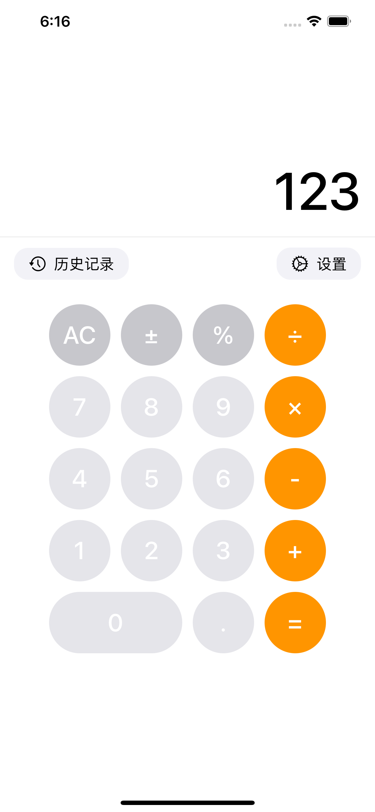
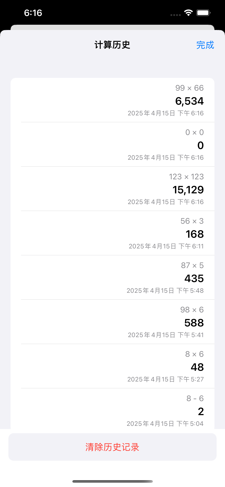
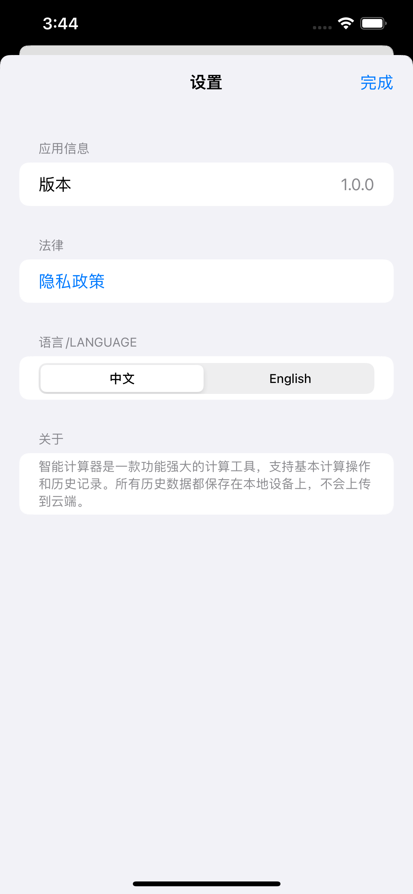
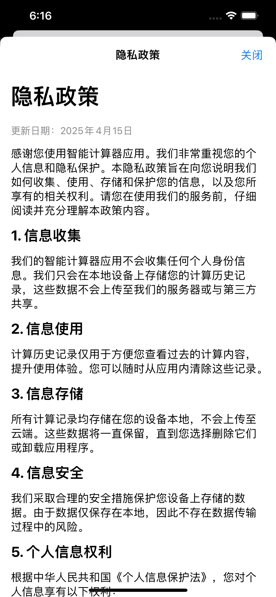

# 智能计算器 (Smart Calculator)

## 苹果商店App名称（App Name）

AppName： Mini Smart Calculator

## 项目概述 (Project Overview)

智能计算器是一款针对中国iOS App Store开发的计算器应用，具有历史记录功能和双语支持。

Smart Calculator is a calculator app developed for the China iOS App Store with calculation history features and bilingual support.

## 功能特点 (Features)

- 基本计算功能：加法、减法、乘法、除法和百分比计算
- 历史记录功能：保存计算历史，并支持查看和重用历史结果
- 双语支持：完整支持简体中文和英文界面
- 符合中国法规：遵循《个人信息保护法》的隐私政策
- 本地存储：所有数据仅保存在用户设备上，不上传云端

## 技术框架 (Technology Stack)

- **语言**：Swift 5
- **UI框架**：SwiftUI
- **目标设备**：iOS 14.0+
- **架构模式**：MVVM (Model-View-ViewModel)

## 安装与运行 (Installation and Running)

1. 克隆仓库 (Clone the repository):
   ```bash
   git clone https://github.com/tjcchen/SmartCalculator.git
   ```

2. 使用Xcode 13或更高版本打开项目

3. 选择模拟器或连接iOS设备

4. 点击运行按钮或按Command+R构建并运行应用

## 项目结构 (Project Structure)

```
SmartCalculator/
├── SmartCalculator/
│   ├── CalculatorModel.swift   # 计算器核心逻辑
│   ├── CalcButton.swift        # 计算器按钮组件
│   ├── ContentView.swift       # 主界面
│   ├── HistoryView.swift       # 历史记录界面
│   ├── PrivacyPolicyView.swift # 隐私政策界面
│   ├── SettingsView.swift      # 设置界面
│   ├── zh-Hans.lproj/          # 中文本地化文件
│   │   └── Localizable.strings
│   └── en.lproj/               # 英文本地化文件
│       └── Localizable.strings
└── SmartCalculator.xcodeproj/  # Xcode项目文件
```

## 中国App Store合规性 (China App Store Compliance)

本应用在设计时充分考虑了中国iOS App Store的特殊要求：

- 提供符合《个人信息保护法》的隐私政策
- 完整支持简体中文界面和英文界面切换
- 所有数据均存储在本地，遵循中国数据法规
- 不包含任何敏感内容或服务

## 应用截图 (App Screenshots)

<div align="center">

| 主计算器界面 (Main Calculator) | 历史记录功能 (History) |
|:-------------------------:|:-------------------------:|
|  |  |
| **设置页面 (Settings)** | **隐私政策 (Privacy Policy)** |
|  |  |

</div>

## 许可证 (License)

© 2025 版权所有

## 贡献 (Contributing)

欢迎提交问题和功能请求！如有兴趣参与项目开发，请提交拉取请求。

## 联系方式 (Contact)

如有任何问题，请联系：chenyangpoppin@163.com

## 发布 app 到 App Store 的资源

- 注册苹果开发者账号（费用 RMB688）：[Developer](https://developer.apple.com)
- 通过苹果开发者注册并下载 Identifiers, Certificates & Profiles（标识符，证书，描述文件）：[Developer Account](https://developer.apple.com/account)
